# Mermaid Diagram Templates

One complete, runnable template per diagram type. Each shows the type's
characteristic syntax. Adapt data and labels; remove unused sections before
delivery. The flowchart template lives separately in [flowchart.template.md].

## 1§ Sequence — invocation / API flow

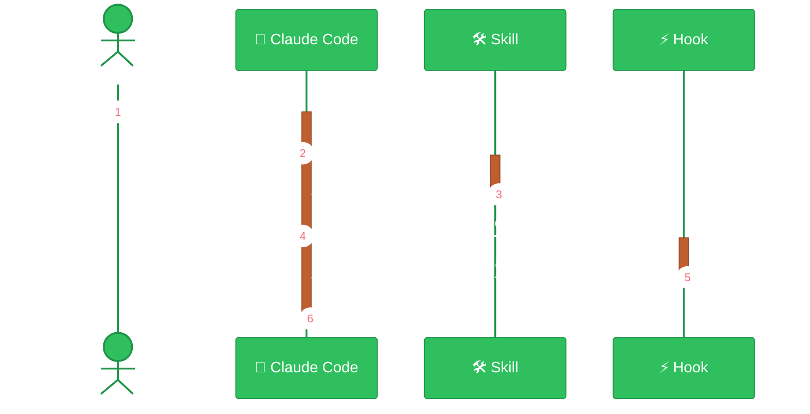

## 2§ State machine — lifecycle

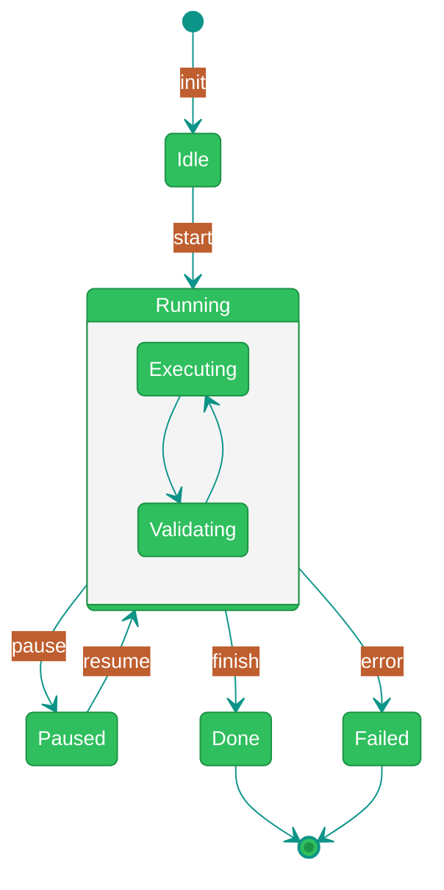

## 3§ Mindmap — feature taxonomy

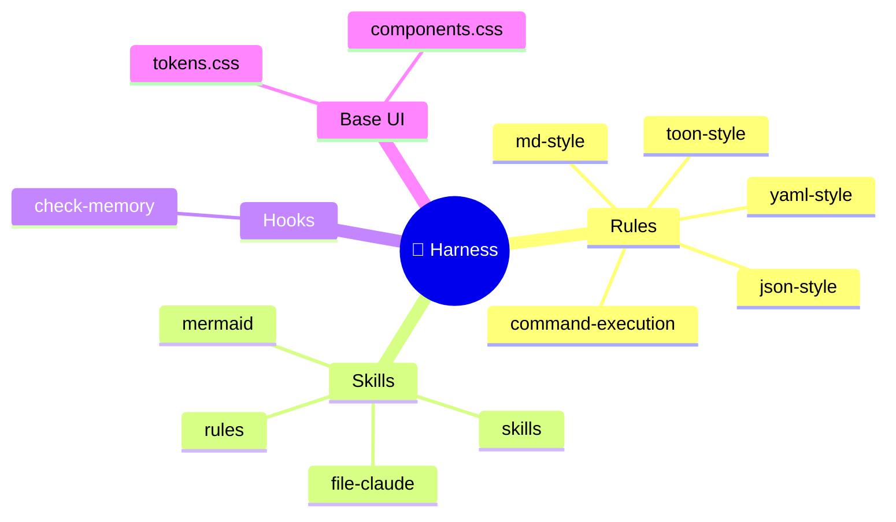

## 4§ Class diagram — data model

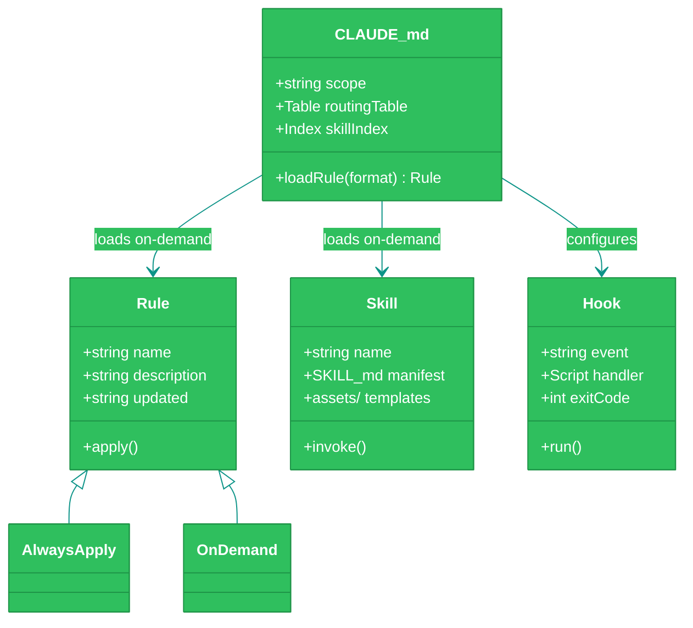

## 5§ Git graph — branching strategy

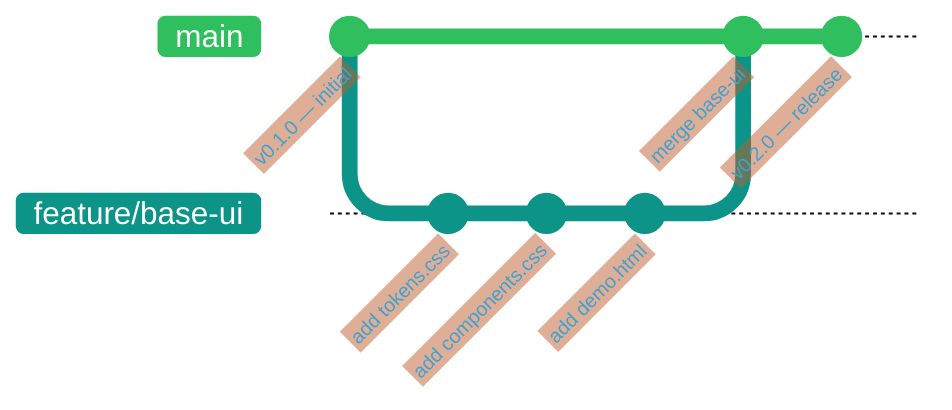

## 6§ Gantt — project timeline

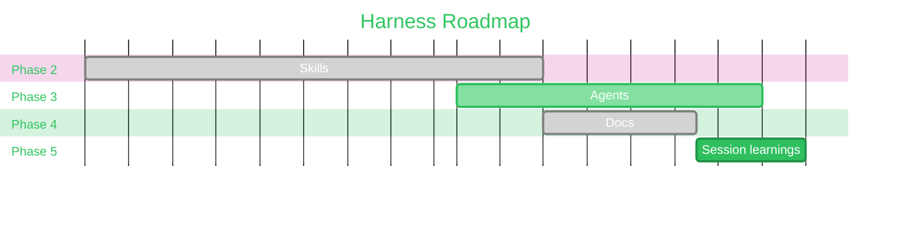

## 7§ Kanban — task board
Requires Mermaid v11+.

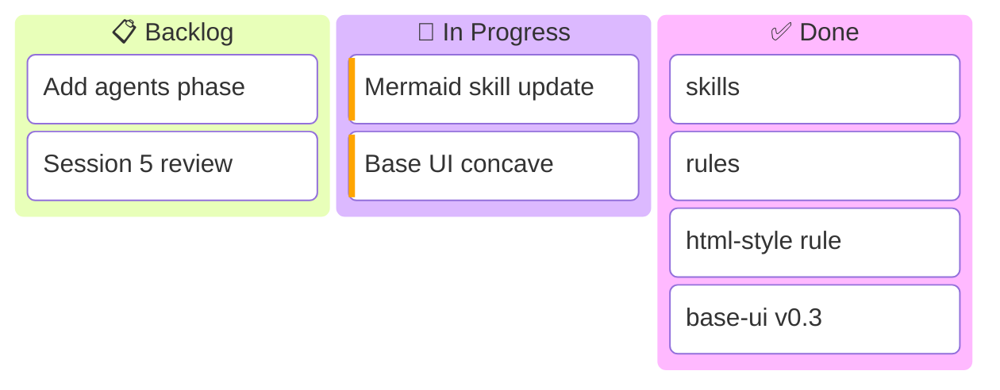

## 8§ Fishbone — root cause analysis
Requires Mermaid v11+. Keyword is `ishikawa`.

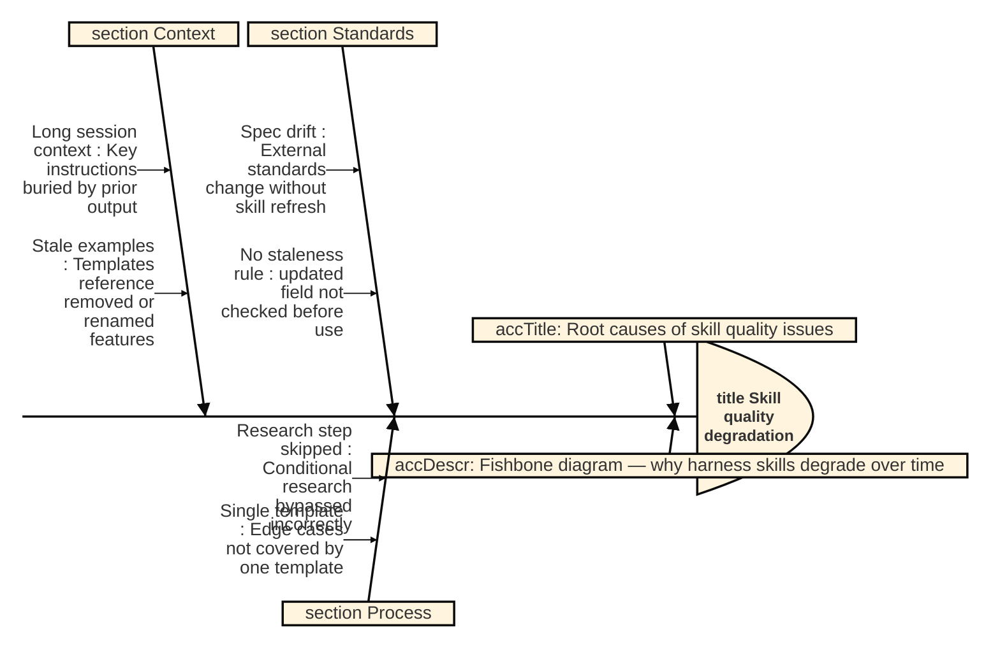

## 9§ Pie chart — proportional data

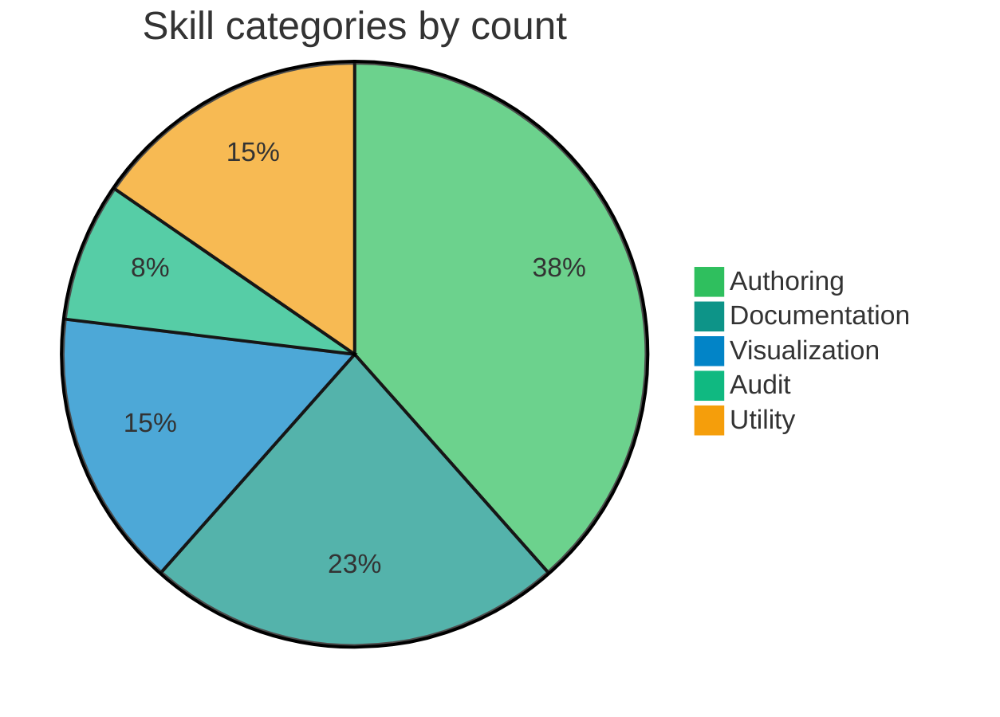

## 10§ Quadrant chart — effort vs. impact

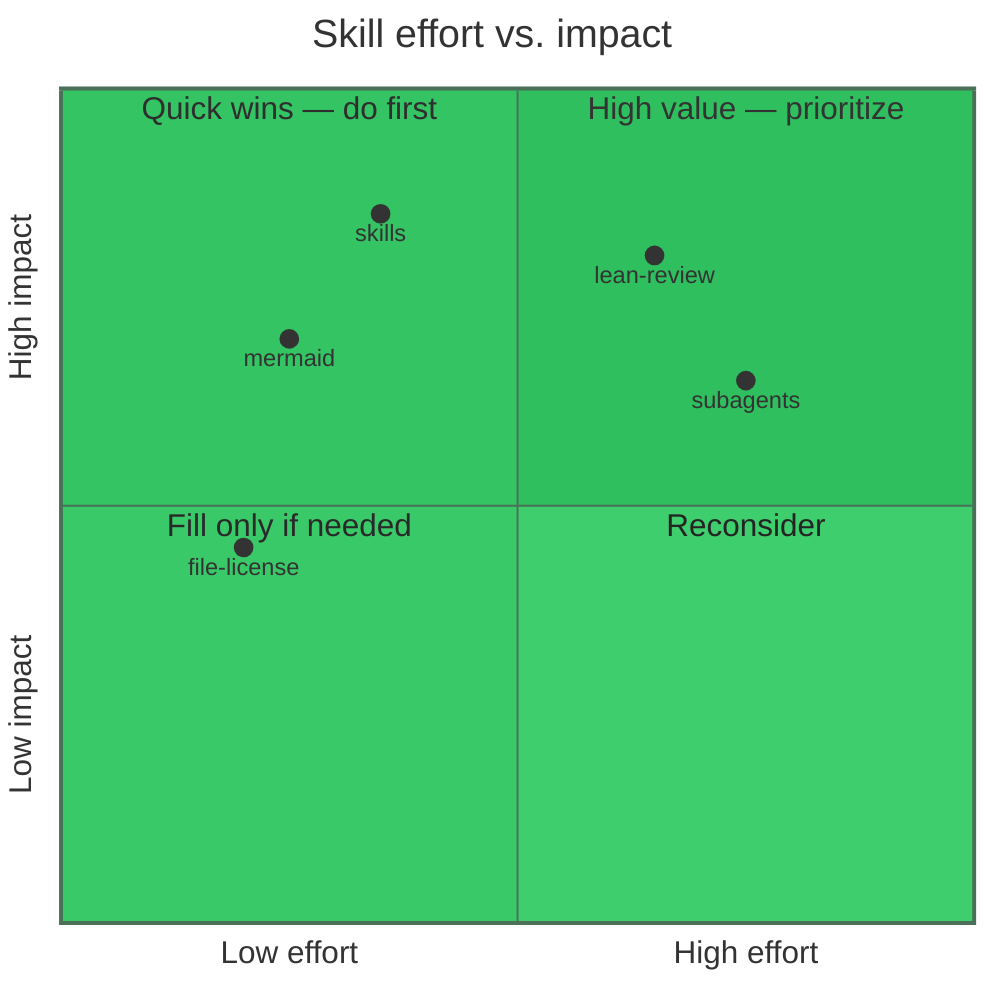

## 11§ XY chart — metric time series

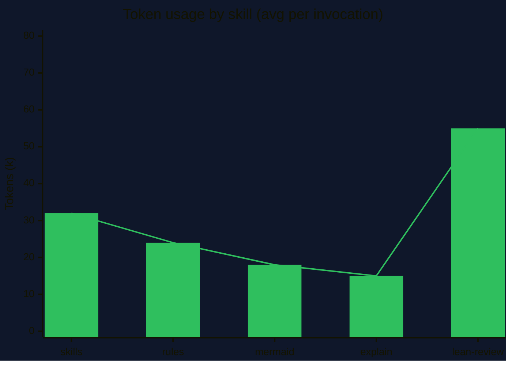
