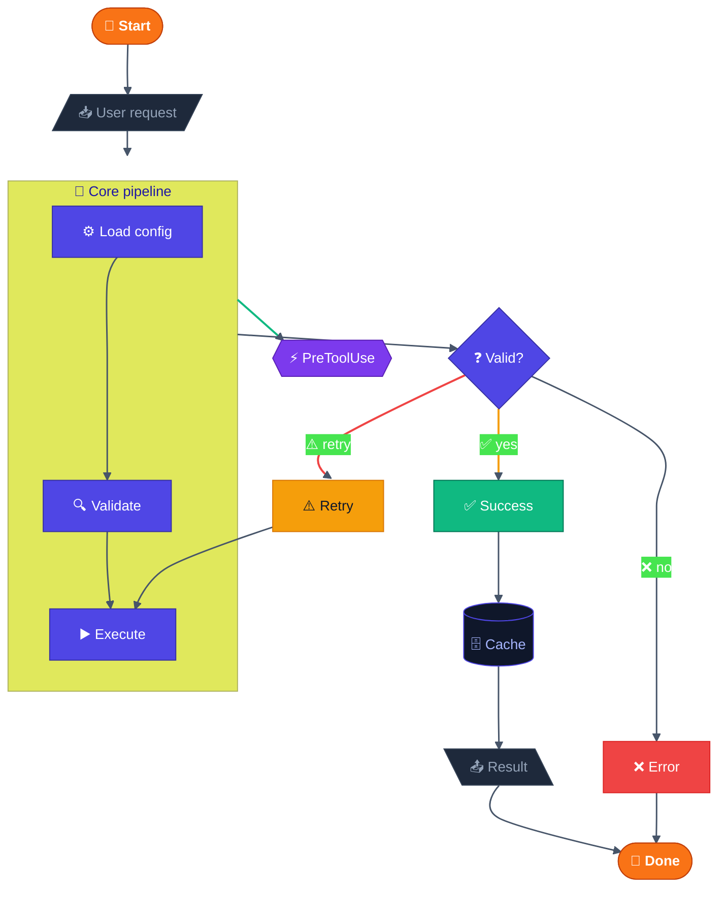

<!-- Annotated flowchart template — shows all classDefs, shapes, linkStyle, and subgraph.
     Copy and adapt. Strip all HTML comments before delivery. -->

```mermaid
%%{init: {
  'theme': 'base',
  'themeVariables': {
    'primaryColor':       '#4f46e5',
    'primaryTextColor':   '#ffffff',
    'primaryBorderColor': '#3730a3',
    'lineColor':          '#f97316',
    'secondBkgColor':     '#0f172a',
    'fontSize':           '14px'
  },
  'flowchart': { 'curve': 'cardinal' }
}}%%
flowchart TD

    %% ── Semantic classes ──────────────────────────────────────────────────────
    classDef entry   fill:#f97316,stroke:#c2410c,color:#fff,font-weight:bold
    classDef process fill:#4f46e5,stroke:#3730a3,color:#fff
    classDef alt     fill:#7c3aed,stroke:#5b21b6,color:#fff
    classDef success fill:#10b981,stroke:#047857,color:#fff
    classDef warning fill:#f59e0b,stroke:#d97706,color:#0f172a
    classDef error   fill:#ef4444,stroke:#dc2626,color:#fff
    classDef io      fill:#1e293b,stroke:#334155,color:#94a3b8
    classDef store   fill:#0f172a,stroke:#4f46e5,color:#a5b4fc
    classDef event   fill:#7c3aed,stroke:#5b21b6,color:#fff

    %% ── Entry / exit (stadium shape) ─────────────────────────────────────────
    START(["🚀 Start"]):::entry
    DONE(["🏁 Done"]):::entry

    %% ── Process nodes (rectangle) ─────────────────────────────────────────────
    LOAD["⚙️ Load config"]:::process
    VALIDATE["🔍 Validate"]:::process
    EXECUTE["▶️ Execute"]:::process

    %% ── Decision (diamond) ────────────────────────────────────────────────────
    CHECK{"❓ Valid?"}

    %% ── Event / hook (hexagon) ────────────────────────────────────────────────
    HOOK{{"⚡ PreToolUse"}}:::event

    %% ── I/O (parallelogram) ───────────────────────────────────────────────────
    INPUT[/"📥 User request"/]:::io
    OUTPUT[\"📤 Result"\]:::io

    %% ── Storage (cylinder) ────────────────────────────────────────────────────
    CACHE[("🗄️ Cache")]:::store

    %% ── Outcomes ──────────────────────────────────────────────────────────────
    OK["✅ Success"]:::success
    WARN["⚠️ Retry"]:::warning
    FAIL["❌ Error"]:::error

    %% ── Subgraph (zone grouping) ──────────────────────────────────────────────
    subgraph core["🔧 Core pipeline"]
        direction LR
        LOAD --> VALIDATE --> EXECUTE
    end

    %% ── Edges ─────────────────────────────────────────────────────────────────
    START --> INPUT --> core
    core --> CHECK
    core --> HOOK

    CHECK -->|"✅ yes"| OK
    CHECK -->|"⚠️ retry"| WARN
    CHECK -->|"❌ no"| FAIL

    OK --> CACHE --> OUTPUT --> DONE
    WARN --> EXECUTE
    FAIL --> DONE

    %% ── Edge styling (0-based index order of --> declarations) ───────────────
    linkStyle default stroke:#475569,stroke-width:1.5px
    linkStyle 5 stroke:#10b981,stroke-width:2px
    linkStyle 6 stroke:#f59e0b,stroke-width:2px
    linkStyle 7 stroke:#ef4444,stroke-width:2px,stroke-dasharray:5\,3
```
